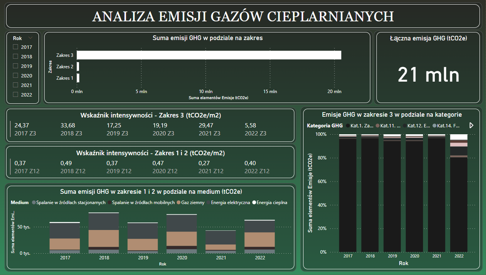

# GHG Emissions Analysis

### Project Overview
---

 This project provides insights into GHG emissions over the years (2017-2022) for a company operating in the sales industry. By analyzing the various scopes (1,2,3), it is possible to identify trends and, with a theoretical connection to a dedicated database, track the carbon footprint on an ongoing basis. In addition, such a dashboard allows to pull ad-hoc data, which could also effectively expedite the reporting of non-financial data. The dashboard includes metrics that calculate intensity ratios based on the surface area of buildings used by the entity (which comply with GRI standards).

The dashboard was made using the Power BI tool.

A preview of the dashboard below:

### Data Sources

The primary dataset used for the analysis was fully fabricated. However, the values are based on real data generated by a company operating in the sales industry.
